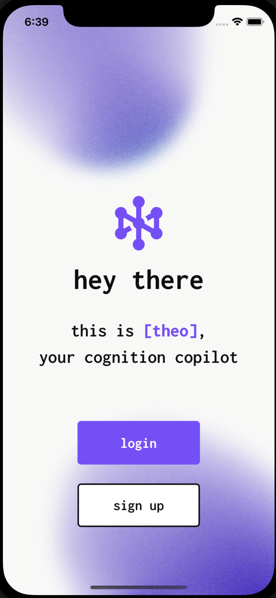

# theo

theo is a cognition copilot that distills your thoughts from pen to perspective ✍️. It helps users organize scattered ideas, reflect on past thoughts, and take actionable steps based on their journaling. By integrating AI-powered insights, theo connects your past and present thoughts, providing meaningful reflections without overwhelming suggestions.

We built theo at TreeHacks 2025, where it won the **Elasticsearch track** 🏆 for its innovative use of vector search in journaling.

- Larry Wang, [Rohan Desai](https://github.com/rohan335), [Sofi Zaozerska](https://github.com/sofigoldfoxhmc), [Andy Xu](https://github.com/andaero)

For more details, visit our project page:
http://devpost.com/software/theo-k1enau

<p align="center">
  
</p>

---

## Features
- **AI-Powered Thought Distillation** – Extracts key insights from unstructured notes.
- **Smart Annotations** – Identifies past connections, asks reflection questions, and suggests actions.
- **Vector Search for Journaling** – Retrieves semantically similar thoughts using ElasticSearch.
- **One-Click Calendar Integration** – Converts insights into actionable steps.
- **Seamless Mobile Experience** – Designed for journaling on the go with a clean, distraction-free UI.

---

## Tech Stack
- **Frontend:** React Native, Expo
- **Backend:** Firebase Cloud Functions
- **Database:** Firestore (NoSQL)
- **Search & Retrieval:** ElasticSearch (vector search for journal entries)
- **AI Models:** Mistral AI for intelligent thought structuring
- **Authentication:** Firebase Auth
- **Hosting & Storage:** Firebase Storage

---

## Installation and Setup

### Prerequisites
Ensure you have the following installed:
- Node.js (v16.x or later)
- npm or yarn
- Expo CLI (`npm install -g expo-cli`)
- Firebase account with Firestore setup
- Elasticsearch instance with vector search enabled

### Backend Setup
1. **Clone the repository:**
    ```bash
    git clone https://github.com/yourusername/theo.git
    cd theo/backend
    ```

2. **Install dependencies:**
    ```bash
    npm install
    ```

3. **Set up environment variables:**
    Create a `.env` file in the `backend` directory with:
    ```env
    FIREBASE_API_KEY=your_firebase_api_key
    FIREBASE_AUTH_DOMAIN=your_firebase_auth_domain
    FIREBASE_PROJECT_ID=your_firebase_project_id
    FIREBASE_STORAGE_BUCKET=your_firebase_storage_bucket
    FIREBASE_MESSAGING_SENDER_ID=your_firebase_messaging_sender_id
    FIREBASE_APP_ID=your_firebase_app_id
    ELASTICSEARCH_URL=your_elasticsearch_instance_url
    ```

4. **Deploy Firebase functions:**
    ```bash
    firebase deploy --only functions
    ```

---

### Frontend Setup
1. **Navigate to the frontend directory:**
    ```bash
    cd ../frontend
    ```

2. **Install dependencies:**
    ```bash
    npm install
    ```

3. **Configure Firebase:**
    Open `firebaseConfig.js` and update with your Firebase credentials:
    ```javascript
    export const firebaseConfig = {
      apiKey: "your_firebase_api_key",
      authDomain: "your_firebase_auth_domain",
      projectId: "your_firebase_project_id",
      storageBucket: "your_firebase_storage_bucket",
      messagingSenderId: "your_firebase_messaging_sender_id",
      appId: "your_firebase_app_id",
    };
    ```

4. **Start the Expo development server:**
    ```bash
    expo start
    ```

---

### Running the Application
- Ensure Firebase functions and Firestore are set up.
- Start the backend (`firebase serve`).
- Start the Expo server (`expo start`).
- Scan the QR code using the Expo Go app on your phone.

theo transforms raw cognition into structured insights. Try it today!

